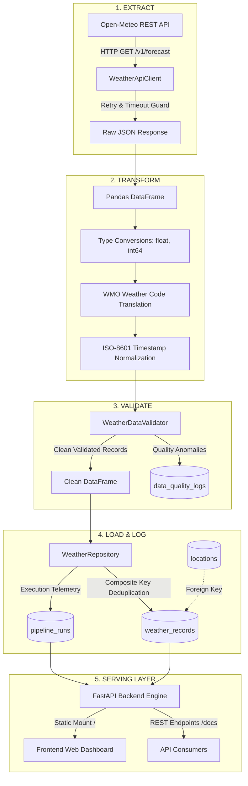

# WEATHERDATA — Weather API Data Warehouse & Analytics Platform

[](https://www.python.org/)
[](https://fastapi.tiangolo.com/)
[](https://www.microsoft.com/sql-server/)
[](https://pandas.pydata.org/)
[](LICENSE)

An end-to-end, production-grade **Data Engineering & Analytics Warehouse** platform built with Python, Microsoft SQL Server, FastAPI, Pandas, and Vanilla JavaScript.

Designed specifically for a final-year B.E. Computer Science student preparing for a **Junior Data Engineer & GenAI** technical interview.

---

## Table of Contents

1. [Project Overview](#1-project-overview)
2. [Key Features](#2-key-features)
3. [Architecture & Data Flow](#3-architecture--data-flow)
4. [Technology Stack](#4-technology-stack)
5. [Database Design & Rationale](#5-database-design--rationale)
6. [ETL Pipeline Architecture](#6-etl-pipeline-architecture)
7. [Repository Structure](#7-repository-structure)
8. [Installation & Setup](#8-installation--setup)
9. [SQL Server Configuration](#9-sql-server-configuration)
10. [Environment Variables](#10-environment-variables)
11. [How to Run the Backend API](#11-how-to-run-the-backend-api)
12. [How to Run the Frontend Dashboard](#12-how-to-run-the-frontend-dashboard)
13. [How to Run the ETL Pipeline (Manual & Scheduled)](#13-how-to-run-the-etl-pipeline)
14. [REST API Documentation](#14-rest-api-documentation)
15. [Analytical SQL Queries](#15-analytical-sql-queries)
16. [Troubleshooting Guide](#16-troubleshooting-guide)
17. [Future Enhancements](#17-future-enhancements)
18. [Interview Preparation Guide (Junior Data Engineer / GenAI)](#18-interview-preparation-guide)

---

## 1. Project Overview

Real-world data systems must ingest data from external HTTP APIs, handle network unreliability, clean dirty payloads, reject statistical anomalies, prevent duplicate insertions, and store historical records for fast analytical queries.

**WEATHERDATA** is a complete data platform that:
- Periodically extracts real-time weather observations for global cities from the **Open-Meteo REST API**.
- Cleans and transforms raw JSON observations using **Pandas**.
- Validates data against strict physical boundary conditions (temperature, humidity, wind speed).
- Persists data idempotently into a normalized **Microsoft SQL Server** warehouse (`WeatherDataWarehouse`).
- Serves high-performance analytical queries through a **FastAPI** backend.
- Visualizes trends and pipeline health on a responsive **Vanilla JavaScript + Chart.js** dashboard.

---

## 2. Key Features

- **No API Key Dependency**: Uses Open-Meteo REST API, eliminating third-party quota locks or secret leaks.
- **Idempotent Incremental Ingestion**: Uses composite key logic `(location_id, recorded_at)` so running the pipeline repeatedly never duplicates records or fails primary key constraints.
- **Resilient Network Layer**: Implements exponential backoff retries (status codes `429`, `500`, `502`, `503`, `504`) with configurable timeout guards.
- **Comprehensive Quality Auditing**: All data anomalies (negative wind speed, out-of-range temperatures, duplicate keys) are logged into a dedicated `data_quality_logs` audit table.
- **FastAPI Layered Architecture**: Strict separation of concerns across Repositories, Pipeline Services, Routes, and Pydantic validation schemas.
- **Zero Heavy Frontend Frameworks**: Built strictly with HTML5, modern CSS3, and Vanilla JavaScript with Chart.js time-series charts.
- **Pipeline Execution Telemetry**: Tracks execution duration, extracted count, loaded count, status (`SUCCESS`, `PARTIAL`, `FAILED`), and error traces.

---

## 3. Architecture & Data Flow



---

## 4. Technology Stack

| Layer | Component | Description |
| :--- | :--- | :--- |
| **Data Ingestion** | Python 3.11+, `requests`, `urllib3` | HTTP client with automatic retry logic and exponential backoff |
| **Data Transformation** | `pandas` (2.2+) | Column mapping, type coercion, missing value handling, batch deduplication |
| **Data Validation** | Custom Data Validator | Business boundary and physical sanity checks |
| **Database** | Microsoft SQL Server 2022 / Express | Relational warehouse with foreign keys, constraints, and nonclustered indexes |
| **Database Driver** | `SQLAlchemy 2.0`, `pyodbc` | Connection pooling and high-performance bulk operations (`fast_executemany`) |
| **Backend REST API** | `FastAPI`, `Uvicorn`, `Pydantic v2` | High-throughput async-ready API with interactive OpenAPI docs (`/docs`) |
| **Frontend UI** | HTML5, CSS3, Vanilla JS, Chart.js | Single-page dashboard with real-time charts, table filters, and pipeline trigger |
| **Testing** | `pytest`, `httpx` | Unit and integration test coverage |

---

## 5. Database Design & Rationale

The database `WeatherDataWarehouse` uses a normalized relational model designed for consistency, integrity, and analytical performance.

### Tables Breakdown

```
locations (Dimension)
├── location_id (PK, INT IDENTITY)
├── city_name (NVARCHAR(100), NOT NULL)
├── country (NVARCHAR(100))
├── latitude (DECIMAL(9,6), NOT NULL)
├── longitude (DECIMAL(9,6), NOT NULL)
└── created_at (DATETIME2)
      │
      │ 1:N
      ▼
weather_records (Fact)
├── weather_id (PK, BIGINT IDENTITY)
├── location_id (FK -> locations.location_id)
├── recorded_at (DATETIME2, NOT NULL)
├── temperature_c (DECIMAL(5,2))
├── humidity_percent (INT)
├── wind_speed_kmh (DECIMAL(6,2))
├── weather_code (INT)
├── weather_condition (NVARCHAR(100))
├── source (NVARCHAR(50))
└── created_at (DATETIME2)

pipeline_runs (Telemetry)
├── run_id (PK, BIGINT IDENTITY)
├── pipeline_name (NVARCHAR(100))
├── started_at (DATETIME2)
├── completed_at (DATETIME2)
├── status (NVARCHAR(20))   -- 'SUCCESS', 'PARTIAL', 'FAILED'
├── records_extracted (INT)
├── records_loaded (INT)
└── error_message (NVARCHAR(MAX))
      │
      │ 1:N
      ▼
data_quality_logs (Audit)
├── quality_id (PK, BIGINT IDENTITY)
├── run_id (FK -> pipeline_runs.run_id)
├── table_name (NVARCHAR(100))
├── issue_type (NVARCHAR(100))
├── issue_count (INT)
└── created_at (DATETIME2)
```

### Why Each Table Exists:
1. **`locations`**: Decouples geographic station metadata from high-frequency time-series observations. Avoids duplicating coordinate numbers and country strings millions of times (3NF normalization).
2. **`weather_records`**: Time-series observation fact table. Enforces referential integrity to `locations` via foreign key and prevents duplicate observations via unique constraint `(location_id, recorded_at)`.
3. **`pipeline_runs`**: Data engineering observability table. Records execution duration, extraction count, loaded count, and failure traces for SLA tracking.
4. **`data_quality_logs`**: Data governance and auditing. Ensures rejected records or out-of-range anomalies are quantified rather than silently dropped.

### Indexes
- `IX_weather_records_location_recorded`: Composite index on `(location_id, recorded_at DESC)` covering `temperature_c`, `humidity_percent`, `wind_speed_kmh`. Speeds up location history lookups.
- `IX_weather_records_recorded_at`: Index on `(recorded_at DESC)` covering temperatures and humidities for cross-station time-window aggregations.
- `IX_pipeline_runs_started_at`: Speeds up dashboard telemetry queries.
- `IX_data_quality_logs_run_id`: Speeds up joining quality logs to pipeline runs.

---

## 6. ETL Pipeline Architecture

The ETL workflow follows standard data engineering practices:

### 1. Extract
- Ingests all active stations from `locations`.
- Issues HTTP GET calls to Open-Meteo (`/v1/forecast?current=temperature_2m,relative_humidity_2m,wind_speed_10m,weather_code`).
- Handles network timeouts and non-200 status codes without crashing the batch.
- Supports offline mock extraction from `data/sample_weather.json` for isolated testing.

### 2. Transform
- Parses JSON observations into a Pandas DataFrame.
- Maps WMO numeric weather codes (0-99) to standardized textual descriptors (e.g. `0` -> `"Clear sky"`, `61` -> `"Slight rain"`, `95` -> `"Thunderstorm"`).
- Coerces columns into precise analytical types (`float`, `int64`, ISO-8601 `datetime64`).
- Deduplicates rows within the in-flight memory batch.

### 3. Validate
- **Temperature Rule**: Bounds check between `-60.0°C` and `+60.0°C`.
- **Humidity Rule**: Bounds check between `0%` and `100%`.
- **Wind Speed Rule**: Bounds check `>= 0.0 km/h`.
- **Required Fields**: Asserts `location_id` and `recorded_at` are non-null.
- **Future Timestamp Check**: Ensures timestamps do not exceed local clock skew allowance.
- Anomalies are logged into `data_quality_logs`.

### 4. Load (Incremental & Idempotent)
- Compares incoming `(location_id, recorded_at)` keys against existing records in SQL Server.
- Filters out already persisted observations.
- Performs bulk insert using SQLAlchemy within an explicit transaction.
- Rolls back the transaction cleanly if an error occurs.

### 5. Log & Telemetry
- Updates `pipeline_runs` with final status (`SUCCESS`, `PARTIAL`, `FAILED`), loaded count, and completion timestamp.

---

## 7. Repository Structure

```
WeatherData/
├── backend/
│   ├── __init__.py
│   ├── config.py                 # Pydantic BaseSettings environment loader
│   ├── database.py               # SQLAlchemy engine & session factory
│   ├── models.py                 # SQLAlchemy ORM declarations
│   ├── schemas.py                # Pydantic input/output schemas
│   ├── api_client.py             # Open-Meteo REST API client & retry logic
│   ├── etl_pipeline.py           # ETL orchestrator (Extract -> Transform -> Validate -> Load)
│   ├── data_validator.py         # Business quality rules & anomaly detection
│   ├── repositories/
│   │   ├── __init__.py
│   │   ├── weather_repository.py # Database queries for weather & analytics
│   │   └── pipeline_repository.py# Database queries for pipeline telemetry
│   └── routes/
│       ├── __init__.py
│       ├── weather_routes.py     # Endpoints for locations and history
│       ├── analytics_routes.py   # Endpoints for aggregates and trend charts
│       └── pipeline_routes.py    # Endpoints to trigger & inspect pipeline runs
│
├── frontend/
│   ├── index.html                # Responsive web dashboard structure
│   ├── style.css                 # Modern dark-slate dashboard styling
│   └── script.js                 # Vanilla JS state, Chart.js charts, API client
│
├── sql/
│   ├── 01_create_database.sql    # DDL: Database creation
│   ├── 02_create_tables.sql      # DDL: Tables and default location seeds
│   ├── 03_indexes.sql            # DDL: Nonclustered indexes & constraints
│   └── 04_sample_queries.sql     # Analytical SQL queries (CTE, Window functions)
│
├── tests/
│   ├── __init__.py
│   ├── test_validator.py         # Unit tests for data quality validator
│   └── test_etl.py               # Unit tests for transformations and incremental load
│
├── data/
│   └── sample_weather.json       # Mock dataset for tests and offline mode
│
├── .env.example                  # Environment variable configuration template
├── .gitignore                    # Git ignore file
├── requirements.txt              # Python package dependencies
└── README.md                     # Comprehensive project documentation
```

---

## 8. Installation & Setup

### Prerequisites
- **Python**: 3.11 or higher
- **SQL Server**: Microsoft SQL Server 2016+ or SQL Server Express (`.\SQLEXPRESS`)
- **ODBC Driver**: ODBC Driver 17 or 18 for SQL Server
- **Git**: Installed and configured

### Step-by-Step Setup

1. **Clone the repository:**
   ```bash
   git clone <repo-url>
   cd WeatherData
   ```

2. **Create and activate a virtual environment:**
   ```powershell
   # Windows PowerShell
   python -m venv venv
   .\venv\Scripts\Activate.ps1
   ```

3. **Install dependencies:**
   ```powershell
   python -m pip install -r requirements.txt
   ```

---

## 9. SQL Server Configuration

Ensure SQL Server (or SQL Server Express) is running. Execute the SQL scripts in order using `sqlcmd` or SQL Server Management Studio (SSMS):

```powershell
# 1. Create database
sqlcmd -S ".\SQLEXPRESS" -E -i sql\01_create_database.sql

# 2. Create tables and seed default locations
sqlcmd -S ".\SQLEXPRESS" -E -d WeatherDataWarehouse -i sql\02_create_tables.sql

# 3. Create performance indexes
sqlcmd -S ".\SQLEXPRESS" -E -d WeatherDataWarehouse -i sql\03_indexes.sql
```

Default seeded cities include:
- Bangalore, India
- Mumbai, India
- Delhi, India
- London, United Kingdom
- New York, United States
- Tokyo, Japan
- Paris, France
- Sydney, Australia

---

## 10. Environment Variables

Create a `.env` file in the root directory:

```ini
# Database Connection (SQL Server)
DB_SERVER=.\SQLEXPRESS
DB_DATABASE=WeatherDataWarehouse
DB_DRIVER=ODBC Driver 17 for SQL Server
DB_TRUSTED_CONNECTION=yes

# Optional: SQL Authentication (if not using Windows Trusted Auth)
# DB_USER=sa
# DB_PASSWORD=YourStrongPassword

# Weather API Configuration (Open-Meteo REST API)
WEATHER_API_BASE_URL=https://api.open-meteo.com/v1/forecast
WEATHER_API_TIMEOUT_SECONDS=10

# Application Settings
APP_ENV=development
LOG_LEVEL=INFO
APP_HOST=127.0.0.1
APP_PORT=8000
```

---

## 11. How to Run the Backend API

Start the FastAPI backend with Uvicorn:

```powershell
python -m backend.main
```

The server will start at `http://127.0.0.1:8000`.
- **Interactive Swagger Docs**: `http://127.0.0.1:8000/docs`
- **ReDoc Documentation**: `http://127.0.0.1:8000/redoc`
- **Health Check Endpoint**: `http://127.0.0.1:8000/health`

---

## 12. How to Run the Frontend Dashboard

The frontend dashboard is directly served by the FastAPI application. Simply open your web browser and navigate to:

```
http://127.0.0.1:8000/
```

### Dashboard Sections
1. **Dashboard**: High-level KPI summary cards, live weather cards for each city, and temperature/humidity trend charts.
2. **Weather History**: Paginated, filterable observation history with city selection.
3. **Analytics**: Statistical breakdowns (overall max, min, mean) and records distribution chart.
4. **Pipeline Monitor**: Live telemetry table tracking every ETL run with data quality audit details.

---

## 13. How to Run the ETL Pipeline

### Option 1: Via the Frontend Dashboard
Click the **"▶ Run ETL Pipeline"** button in the top navbar or Pipeline Monitor section.

### Option 2: Via REST API
```powershell
# Live Ingestion
curl -X POST "http://127.0.0.1:8000/api/pipeline/run" -H "Content-Type: application/json" -d "{\"use_sample_data\": false}"

# Offline Sample Ingestion
curl -X POST "http://127.0.0.1:8000/api/pipeline/run" -H "Content-Type: application/json" -d "{\"use_sample_data\": true}"
```

### Option 3: Via Python Command Line / Windows Task Scheduler
```powershell
python -c "from backend.database import SessionLocal; from backend.etl_pipeline import WeatherETLPipeline; db = SessionLocal(); pipeline = WeatherETLPipeline(); print(pipeline.run(db)); db.close()"
```

To schedule periodic collection every hour, create a Windows Scheduled Task targeting the command above.

---

## 14. REST API Documentation

| Method | Path | Description | Query / Body Parameters |
| :--- | :--- | :--- | :--- |
| `GET` | `/` | Web Dashboard (browser) or Health Check (JSON) | None |
| `GET` | `/health` | Service and Database connectivity check | None |
| `GET` | `/api/locations` | List all monitored stations | None |
| `POST` | `/api/locations` | Add a new location to monitor | `{"city_name", "country", "latitude", "longitude"}` |
| `GET` | `/api/weather/latest` | Most recent weather for each station | None |
| `GET` | `/api/weather/history` | Historical observations with filters | `city`, `limit` (default 100), `start_date`, `end_date` |
| `GET` | `/api/weather/history/{city}` | History for a specific city | `limit` (default 100) |
| `GET` | `/api/analytics/summary` | Aggregate KPI warehouse metrics | None |
| `GET` | `/api/analytics/temperature-trend` | Daily temperature aggregates | `days` (default 7) |
| `GET` | `/api/analytics/humidity-trend` | Daily humidity aggregates | `days` (default 7) |
| `POST` | `/api/pipeline/run` | Manually trigger ETL run | `{"use_sample_data": bool}` |
| `GET` | `/api/pipeline/runs` | Execution history telemetry | `limit` (default 20) |
| `GET` | `/api/pipeline/runs/{run_id}` | Details and quality logs for a run | None |

---

## 15. Analytical SQL Queries

Located in `sql/04_sample_queries.sql`:

### 1. Latest Weather Observation per City (Window Function)
```sql
WITH RankedWeather AS (
    SELECT 
        l.city_name,
        l.country,
        w.recorded_at,
        w.temperature_c,
        w.humidity_percent,
        w.wind_speed_kmh,
        w.weather_condition,
        ROW_NUMBER() OVER(PARTITION BY l.location_id ORDER BY w.recorded_at DESC) AS rn
    FROM weather_records w
    INNER JOIN locations l ON w.location_id = l.location_id
)
SELECT city_name, country, recorded_at, temperature_c, humidity_percent, wind_speed_kmh, weather_condition
FROM RankedWeather
WHERE rn = 1
ORDER BY city_name;
```

### 2. Daily Temperature Aggregates
```sql
SELECT 
    CAST(w.recorded_at AS DATE) AS observation_date,
    l.city_name,
    ROUND(AVG(w.temperature_c), 2) AS avg_temp,
    MAX(w.temperature_c) AS max_temp,
    MIN(w.temperature_c) AS min_temp,
    COUNT(*) AS sample_count
FROM weather_records w
INNER JOIN locations l ON w.location_id = l.location_id
GROUP BY CAST(w.recorded_at AS DATE), l.city_name
ORDER BY observation_date DESC, l.city_name;
```

---

## 16. Troubleshooting Guide

| Issue | Likely Cause | Solution |
| :--- | :--- | :--- |
| `Login timeout expired` / `Cannot open database` | SQL Server service is stopped | Start service via PowerShell: `Start-Service MSSQL$SQLEXPRESS` |
| `Data source name not found and no default driver specified` | ODBC Driver 17 is missing | Install Microsoft ODBC Driver 17 for SQL Server, or adjust `DB_DRIVER` in `.env` |
| `Request failed: Connection timeout` | Internet disconnected or firewall | Verify internet access or run pipeline in mock mode (`use_sample_data: true`) |
| `Duplicates skipped == 8` | Data already exists for that hour | Expected behavior: Open-Meteo current weather updates every 15-60 minutes. Idempotent loader avoids duplicates. |

---

## 17. Future Enhancements

- **Phase 8: GenAI Natural Language Query Assistant**: Safe Text-to-SQL module converting natural language prompts into read-only SQL queries.
- **Airflow Orchestration**: Migrate from in-app trigger to an Apache Airflow DAG for enterprise pipeline scheduling.
- **Delta Lake / Parquet Storage**: Add cold-path data lake storage export for historical analytics.

---

## 18. Interview Preparation Guide

### Key Questions & Model Answers for Junior Data Engineer – GenAI Interviews

#### Q1: What makes your ETL pipeline idempotent?
> **Answer**: Idempotency means executing the pipeline multiple times with the same input produces the exact same state without unintended side effects. In WEATHERDATA, idempotency is achieved via a composite key `(location_id, recorded_at)`. Before insertion, the loader checks existing keys in SQL Server and discards duplicates. Furthermore, a unique database constraint guarantees that even in concurrent conditions, duplicate timestamps for the same location can never be inserted.

#### Q2: How did you design the data warehouse schema?
> **Answer**: We implemented a normalized relational model separating dimensions (`locations`) from facts (`weather_records`). This avoids data redundancy (coordinates and country names are stored once). Indexes were created on `(location_id, recorded_at DESC)` and `(recorded_at DESC)` to optimize time-series queries and window functions. Observability is maintained via `pipeline_runs` and `data_quality_logs`.

#### Q3: How do you handle data quality anomalies?
> **Answer**: Rather than silently ignoring bad data or letting corrupt values crash downstream analytics, the `WeatherDataValidator` inspects incoming DataFrames against physical constraints (-60°C to +60°C for temperature, 0-100% for humidity, >=0 for wind speed). Invalid rows are quarantined, and the anomaly type and count are persisted to `data_quality_logs` linked to the specific pipeline run.

#### Q4: Why use FastAPI over Flask or Django?
> **Answer**: FastAPI provides native asynchronous performance, automatic Pydantic data validation and serialization, and out-of-the-box interactive OpenAPI/Swagger documentation (`/docs`), making it ideal for high-throughput data engineering API layers.

#### Q5: How would you safely introduce GenAI to this warehouse?
> **Answer**: GenAI (Text-to-SQL) should strictly operate in a read-only sandboxed role. Safety measures include:
> 1. Restricting queries strictly to `SELECT` statements (disallowing `DROP`, `DELETE`, `UPDATE`, `INSERT`, `ALTER`).
> 2. Connecting with a low-privilege database user that has only `db_datareader` rights.
> 3. Enforcing query execution timeouts and row limits (`TOP 100`) to prevent denial-of-service queries.
