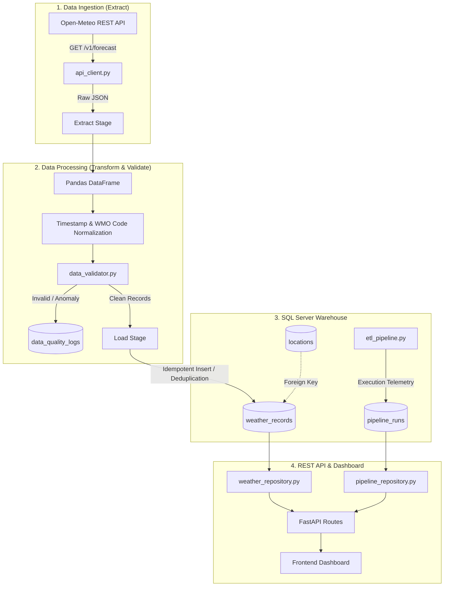

# WEATHERDATA — Weather API Data Warehouse & Analytics Platform

A production-grade, end-to-end Data Engineering and Analytics platform built with **Python, SQL Server, FastAPI, and Vanilla JavaScript**. Designed to demonstrate core data engineering proficiencies: REST API extraction, data cleansing with Pandas, validation, incremental loading, relational modeling, and interactive analytical visualization.

---

## 1. Project Overview

Weather data is continuously changing, requiring automated ingestion, validation, and historical persistence for analytical queries. **WEATHERDATA** extracts live meteorological observations from the Open-Meteo REST API, transforms and cleanses the raw JSON payload using Pandas, enforces rigorous business quality rules, and incrementally loads deduplicated records into a Microsoft SQL Server Data Warehouse (`WeatherDataWarehouse`).

FastAPI powers the RESTful backend, offering high-performance analytical endpoints, while a responsive frontend dashboard visualizes temperature/humidity trends, historical records, and pipeline execution logs in real time.

---

## 2. Key Features

- **Automated REST Ingestion**: Pulls live meteorological data (temperature, relative humidity, wind speed, WMO weather codes) across worldwide locations.
- **Robust ETL Pipeline**:
  - **Extract**: Fault-tolerant HTTP requests with retries and timeout protection.
  - **Transform**: Schema standardization, ISO-8601 timestamp parsing, and WMO weather condition normalization via Pandas.
  - **Validate**: Boundary checks (-60°C to +60°C, 0–100% humidity, non-negative wind speed) with automated logging of data anomalies.
  - **Load**: Transactional, idempotent incremental loader with duplicate prevention.
- **Relational Data Warehouse**: Normalized SQL Server schema with indexing on location and observation timestamps.
- **Analytical REST API**: Built with FastAPI for fast query execution, comprehensive OpenAPI documentation (`/docs`), and Pydantic validation.
- **Interactive Web Dashboard**: Native HTML5, modern CSS, and Vanilla JavaScript with Chart.js time-series charts, location filters, and a live ETL trigger.
- **Interview-Ready Architecture**: Clean separation of concerns (Repositories, Pipeline Services, Routes, Schemas).

---

## 3. Technology Stack

| Layer | Technologies |
| :--- | :--- |
| **Frontend** | HTML5, CSS3 (Modern Flex/Grid), Vanilla JavaScript (ES6+ Fetch API), Chart.js |
| **Backend API** | Python 3.11+, FastAPI, Uvicorn, Pydantic v2, Pydantic-Settings |
| **Data Engineering** | Pandas, Requests, SQLAlchemy 2.0, pyodbc |
| **Database** | Microsoft SQL Server 2022 / SQL Server Express, T-SQL |
| **Testing** | Pytest, FastAPI TestClient, HTTPX |
| **Version Control** | Git |

---

## 4. Architecture Diagram



---

## 5. Folder Structure

```
WeatherData/
├── backend/
│   ├── __init__.py
│   ├── config.py                 # Configuration loader using pydantic-settings
│   ├── database.py               # SQLAlchemy engine & session factory for SQL Server
│   ├── models.py                 # SQLAlchemy ORM entity models
│   ├── schemas.py                # Pydantic request & response schemas
│   ├── api_client.py             # Open-Meteo REST client with retries
│   ├── etl_pipeline.py           # ETL orchestrator (Extract -> Transform -> Validate -> Load)
│   ├── data_validator.py         # Business validation logic & anomaly tracking
│   ├── repositories/
│   │   ├── __init__.py
│   │   ├── weather_repository.py # Database queries for weather & analytics
│   │   └── pipeline_repository.py# Database queries for pipeline execution logs
│   └── routes/
│       ├── __init__.py
│       ├── weather_routes.py     # Endpoints for locations & historical observations
│       ├── analytics_routes.py   # Endpoints for summary statistics & time-series trends
│       └── pipeline_routes.py    # Endpoints to trigger and inspect ETL runs
│
├── frontend/
│   ├── index.html                # Responsive web dashboard layout
│   ├── style.css                 # Clean, modern responsive styling
│   └── script.js                 # Vanilla JS state, Chart.js integrations, API calls
│
├── sql/
│   ├── 01_create_database.sql    # DDL: Create WeatherDataWarehouse
│   ├── 02_create_tables.sql      # DDL: Tables (locations, weather_records, pipeline_runs, quality_logs)
│   ├── 03_indexes.sql            # Performance indexes & unique constraints
│   └── 04_sample_queries.sql     # Analytical SQL queries
│
├── tests/
│   ├── __init__.py
│   ├── test_validator.py         # Unit tests for data quality & range validators
│   └── test_etl.py               # Unit tests for parsing, transformation, and deduplication
│
├── data/
│   └── sample_weather.json       # Mock dataset for testing & offline mode
│
├── .env.example                  # Template configuration file
├── .gitignore                    # Version control ignore list
├── requirements.txt              # Production and development dependencies
└── README.md                     # Complete project documentation
```

---

## 6. Installation & Quickstart

### Prerequisites
- Python 3.11 or higher
- Microsoft SQL Server (Local, Express `.\SQLEXPRESS`, or Developer Edition)
- ODBC Driver 17 or 18 for SQL Server

### Step 1: Clone and Set Up Virtual Environment
```bash
git clone <repository_url>
cd WeatherData
python -m venv venv
# On Windows PowerShell:
.\venv\Scripts\Activate.ps1
```

### Step 2: Install Dependencies
```bash
pip install -r requirements.txt
```

### Step 3: Configure Environment Variables
Copy `.env.example` to `.env` and verify database settings:
```ini
DB_SERVER=.\SQLEXPRESS
DB_DATABASE=WeatherDataWarehouse
DB_DRIVER=ODBC Driver 17 for SQL Server
DB_TRUSTED_CONNECTION=yes
```

### Step 4: Run Backend Server
```bash
python -m backend.main
```
The API will start at `http://127.0.0.1:8000`. Interactive Swagger documentation is available at `http://127.0.0.1:8000/docs`.
The dashboard is accessible directly at `http://127.0.0.1:8000`.

---

## 7. Development Status
- [x] **Phase 1: Project Setup** (Directory structure, requirements, settings, health endpoint)
- [ ] **Phase 2: Database** (SQL Server schema, tables, indexes, pyodbc connection)
- [ ] **Phase 3: Weather API** (Open-Meteo client, JSON parsing, sample data)
- [ ] **Phase 4: ETL Pipeline** (Extract, transform, validate, load, deduplication)
- [ ] **Phase 5: Backend APIs** (FastAPI routes for weather, analytics, pipeline runs)
- [ ] **Phase 6: Frontend Dashboard** (HTML/CSS/JS, Chart.js trends, live trigger)
- [ ] **Phase 7: Testing & Documentation** (Automated tests, interview guide)
- [ ] **Phase 8: Optional GenAI** (Natural language to SQL, read-only analytical assistant)
